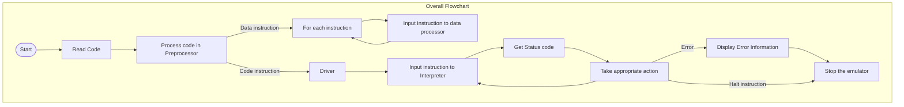
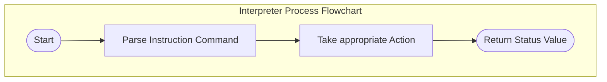
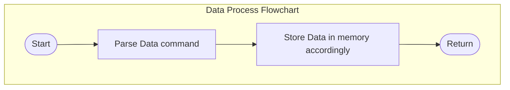
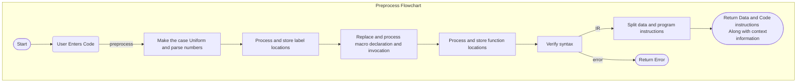

```mermaid
graph TD
subgraph Overall Flowchart
    start([Start])-->read
    read[Read Code]-->preprocess
    preprocess[Process code in Preprocessor]-->|Data instruction|data
    preprocess[Process code in Preprocessor]-->|Code instruction|driver
    data[For each instruction]-->data_processor
    data_processor[Input instruction to data processor]-->data
    driver[Driver]-->instr
    instr[Input instruction to Interpreter]-->status
    status[Get Status code]-->status_action
    status_action[Take appropriate action]-->instr
    status_action[Take appropriate action]-->|Error|error
    error[Display Error Information]-->halt
    status_action[Take appropriate action]-->|Halt instruction|halt
    halt[Stop the emulator]
end
```

```mermaid
graph TD
subgraph Interpreter Process Flowchart
    start([Start])-->instr_command
    instr_command[Parse Instruction Command]-->action
    action[Take appropriate Action]-->return
    return([Return Status Value])
end
```

```mermaid
graph TD
subgraph Data Process Flowchart
    start([Start])-->data_command
    data_command[Parse Data command]-->action
    action[Store Data in memory accordingly]-->return
    return([Return])
end
```

```mermaid
graph TD
subgraph Preprocess Flowchart
    start([Start])-->input
    input(User Enters Code)-->|preprocess|case
    case[Make the case Uniform and parse numbers]-->labels
    labels[Process and store label locations]-->macro
    macro[Replace and process <br/>macro declaration and invocation]-->function
    function[Process and store function locations]-->verify
    verify[Verify syntax]-->|IR|split
    verify[Verify syntax]-->|error|error([Return Error])
    split[Split data and program instructions]-->return
    return([Return Data and Code instructions <br/> Along with context information])
end
```
